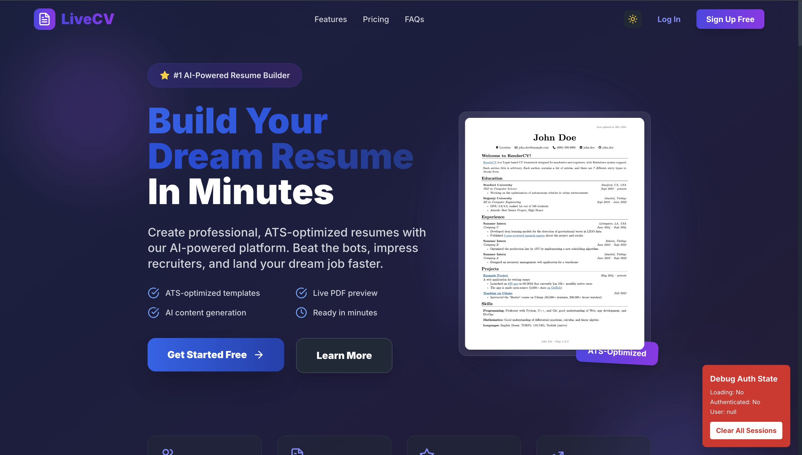
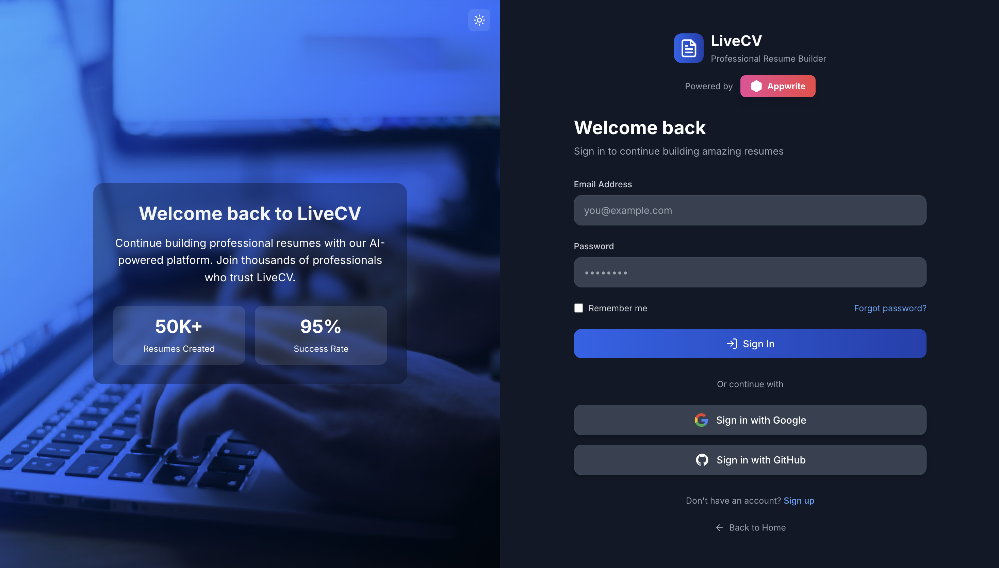
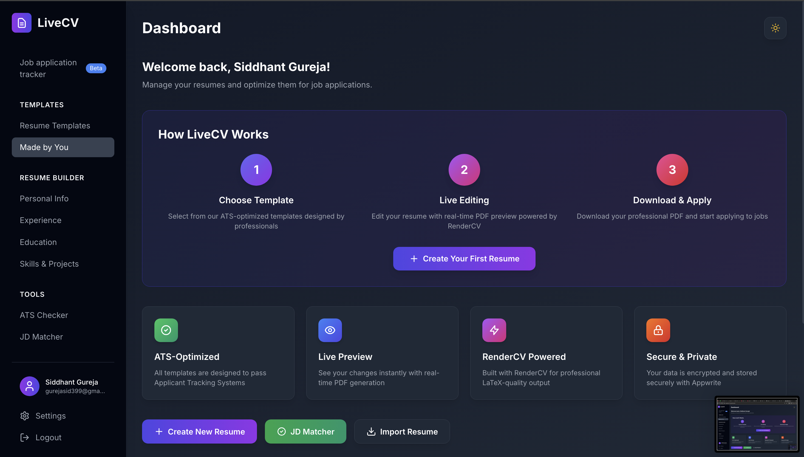
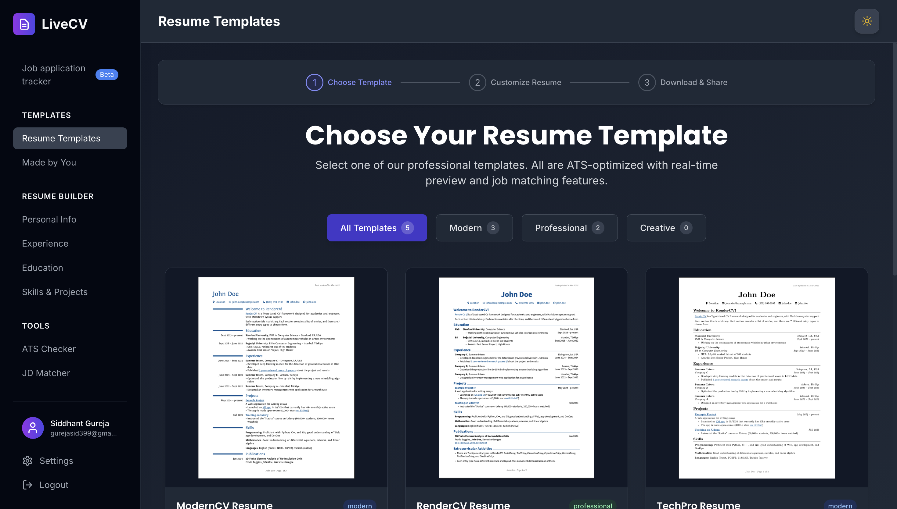

# Hackathon Submission: LiveCV

## GitHub handle
@sidgureja7803

## Project Title
LiveCV - AI-Powered Resume Builder

## Project Description    
LiveCV is a modern AI-powered resume builder that empowers job seekers to create professional, ATS-optimized resumes with real-time collaboration and instant PDF generation.

Built using RenderCV for high-quality PDF rendering and Appwrite for authentication, databases, and storage, LiveCV allows users to build, edit, and manage resumes seamlessly — anytime, anywhere.

## Inspiration behind the Project  
Most resume builders today focus only on design, ignoring how resumes are filtered by Applicant Tracking Systems (ATS). Additionally, job seekers struggle to tailor resumes for different job descriptions.

LiveCV was created to solve these challenges by:
- Providing AI-based job description matching
- Offering ATS keyword optimization
- Supporting real-time collaborative editing
- Enabling multi-theme, PDF-ready resumes with secure cloud backup

This project aims to make resume creation fast, smart, and collaborative for everyone.

## Tech Stack    
- Frontend: React.js, Tailwind CSS, Socket.IO
- Backend: Appwrite (Auth, Databases, Storage), Node.js, Express.js
- PDF Engine: RenderCV (Typst rendering engine)
- AI Layer: Job description matching, ATS optimization
- Hosting: Vercel + Appwrite Cloud
- Collaboration: WebSockets via Socket.IO

### Appwrite products
- [x] Auth
- [x] Databases
- [x] Storage
- [ ] Functions
- [ ] Messaging
- [x] Realtime
- [x] Sites

## Project Repo  
https://github.com/sidgureja7803/LiveCV.git

## Deployed Site URL
https://livecv.online/

## Demo Video/Photos  

### Screenshots:

### Workflow Summary
1. User Signs Up / Logs In (Appwrite Auth)
2. Creates Resume (via frontend form)
3. Backend Generates YAML file
4. RenderCV Engine converts YAML → PDF
5. Appwrite Storage & Database store:
   - resume-yamls → YAML files
   - resume-pdfs → PDF files
   - resumes collection → Metadata

Users can then:
- View or download resumes instantly
- Edit and auto-save progress
- Collaborate in real time
- Access from any device securely

### Key Features
- ⚡ Live PDF Preview: Debounced real-time updates
- 🤖 ATS Optimization: Score and keyword analysis
- 💬 Job Description Matching: AI-tailored resume recommendations
- 👥 Live Collaboration: Socket.IO-powered editing
- 🎨 Multiple Themes: Choose from ModernCV, Classic, SB2Nov, and more
- 🔒 Appwrite Integration: Secure auth, storage, and user data
- 🧠 Smart Caching: In-memory PDF caching for instant performance

### Summary
LiveCV redefines the resume-building experience by combining AI intelligence, real-time collaboration, and secure cloud infrastructure. It's more than a builder — it's a smart career companion that helps users craft resumes that get noticed.

## Contributors
- [Siddhant Gureja](https://github.com/sidgureja7803) - Project Lead