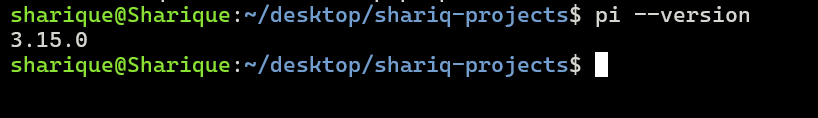
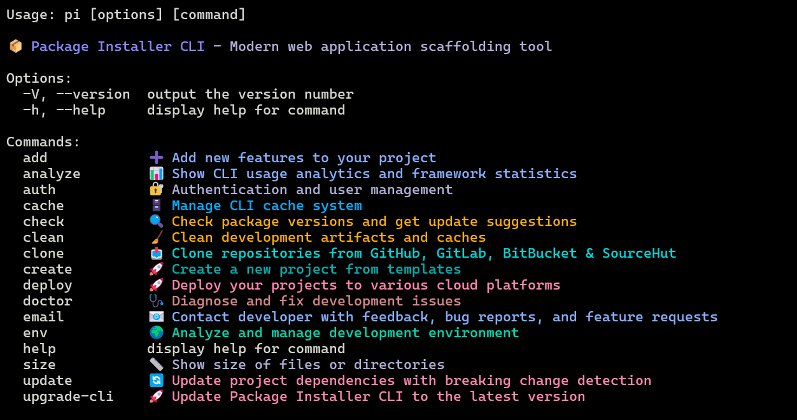
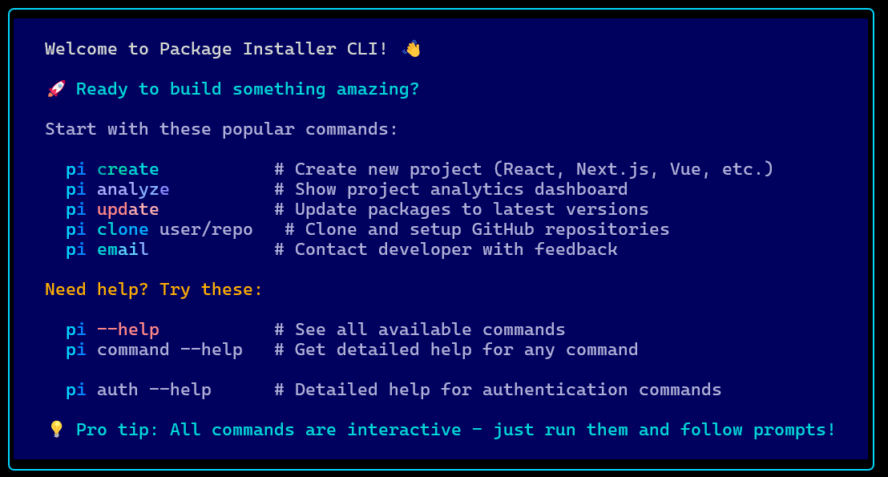
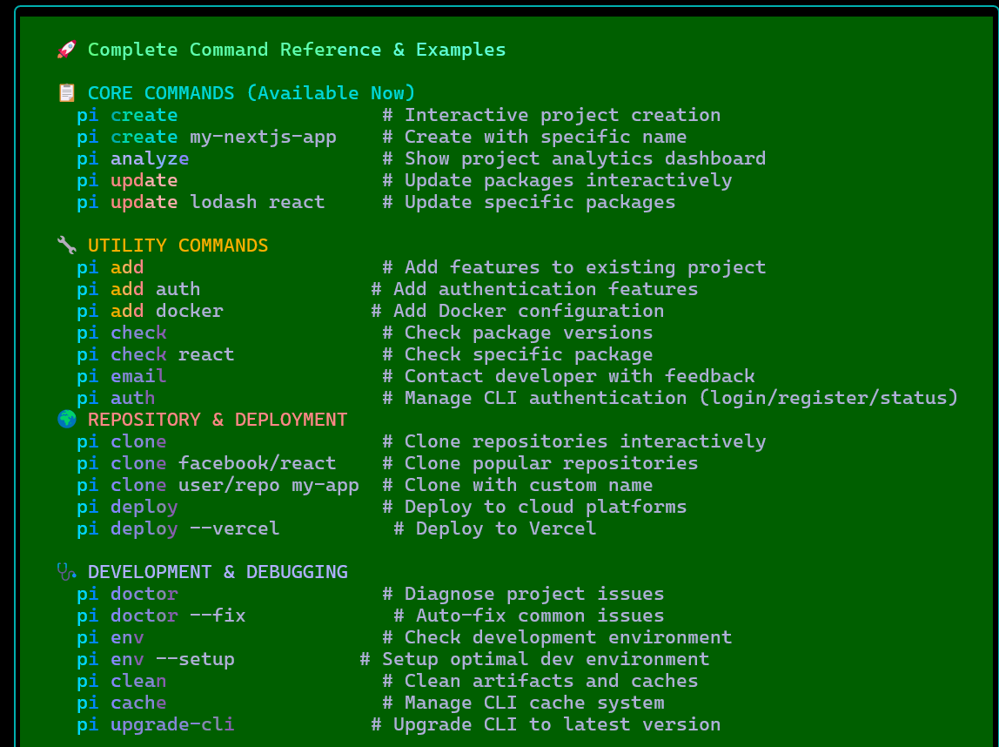
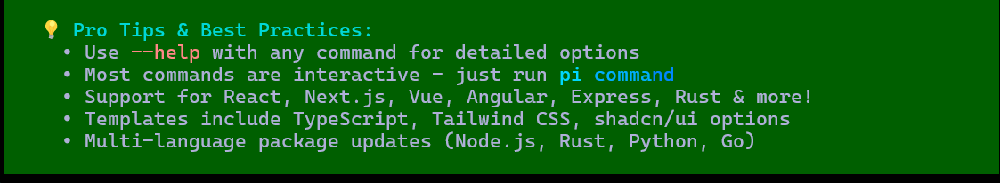

# Hackathon Submission: Package Installer CLI

## GitHub handle
@0xshariq

<!--
@adityaoberai
-->

## Project Title
Package Installer CLI

<!--
CodeCapture
-->

## Project Description    
The project I created is a **powerful, cross-platform CLI** for modern development workflows. Create projects, manage dependencies, analyze codebases, and streamline your development process with intelligent automation.Basically this tool is useful for hackathons.

## 🚀 Core Features

- **🎨 Project Creation**: React, Next.js, Express, Angular, Vue, Rust templates
- **🚀 Cloud Deployment**: Seamless deployment to Vercel, AWS, GitHub Pages
- **📊 Code Analysis**: Comprehensive project analytics and insights
- **📦 Dependency Management**: Smart updates across multiple package managers
- **🩺 Health Diagnostics**: Automated issue detection and fixes
- **🌍 Environment Analysis**: Development environment optimization
- **🗄️ Intelligent Caching**: Performance optimization with smart caching
- **📈 Usage Analytics**: Real-time insights and productivity metrics
- **⚡ Cross-Platform**: Windows, macOS, Linux support

<!--
The project I created is...
-->

## Inspiration behind the Project  
The reason I chose this idea was to simplify the project setup for beginners and experts.

<!--
The reason I chose this idea/project was...
-->

## Tech Stack    
The technologies I used is only typescript and some packages like commander.js,inquirer,etc which are essential for a cli tools

<!--
The technologies I used...
-->

### Appwrite products
I haven't used any products

<!--
Update the checkbox to [x] for the products used.

e.g.:

- [x] Auth 
-->

- [ ] Auth
- [ ] Databases
- [ ] Storage
- [ ] Functions
- [ ] Messaging
- [ ] Realtime
- [ ] Sites

## Project Repo  
https://github.com/0xshariq/package-installer-cli

<!--
https://github.com/code-capture/CodeCapture-Xamarin
-->

## Deployed Site URL
I haven't deployed on appwrite network.
but I have publish on npmjs.com,pypi.org,crates.io and rubygems.org

https://pypi.org/project/package-installer-cli/  
https://www.npmjs.com/package/@0xshariq/package-installer/  
https://crates.io/crates/package-installer-cli/  
https://rubygems.org/gems/package-installer-cli/  

<!--
https://hacktoberfest.appwrite.network
-->

## Demo Video/Photos  

<!--
https://www.youtube.com/watch?v=9IBaX1avYWc
-->
